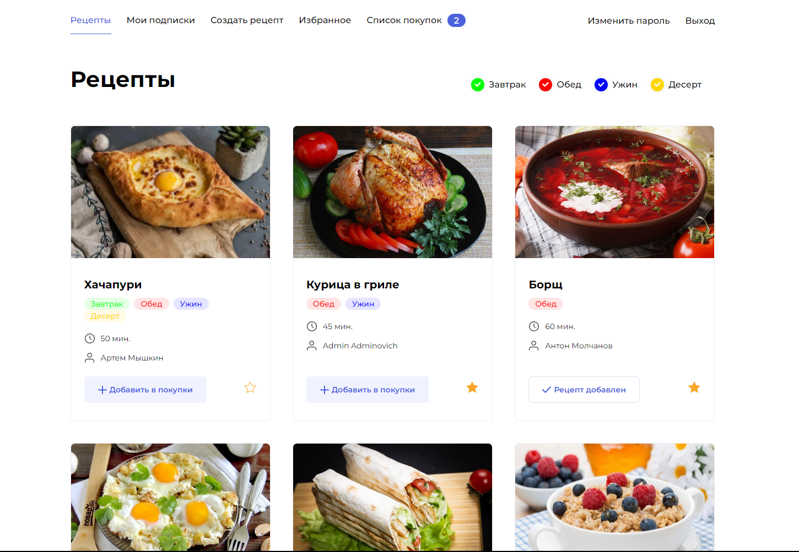
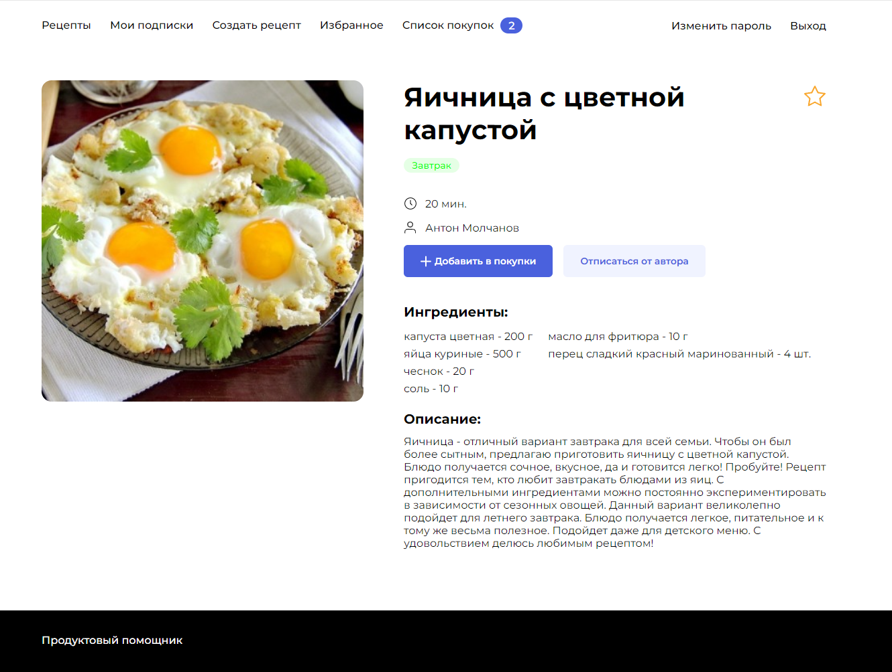
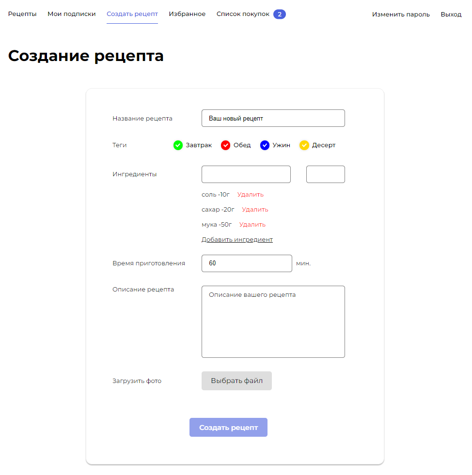
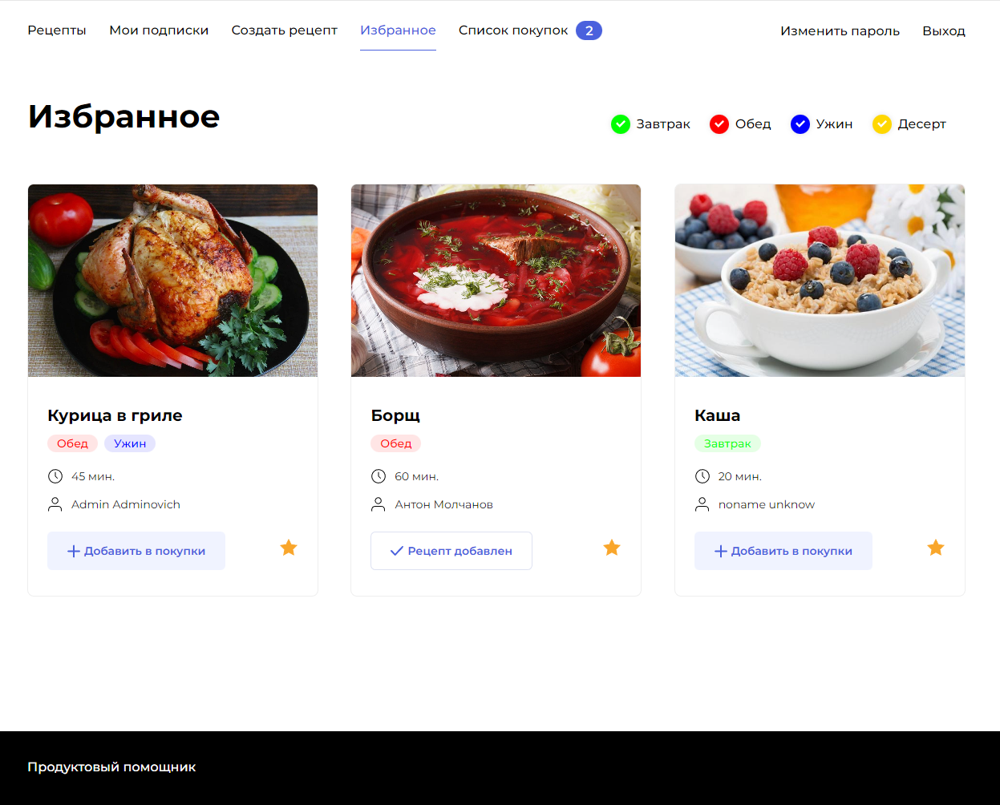
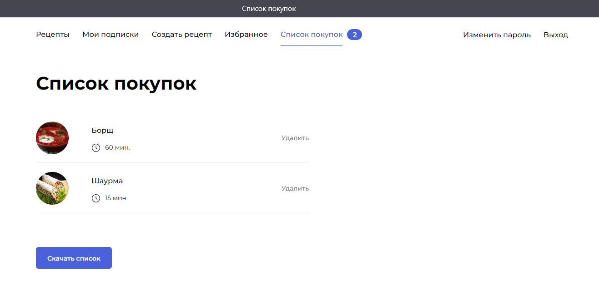

# Дипломный проект FOODGRAM🍔 

### 📖Описание
Проект Foodgram «Продуктовый помощник». Онлайн-сервис где пользователи могут публиковать рецепты, подписываться на публикации других пользователей, добавлять понравившиеся рецепты в список «Избранное», а перед походом в магазин скачивать сводный список продуктов, необходимых для приготовления одного или нескольких выбранных блюд.
### 🛠️Используемые технологии


<h3>🖼️Иллюстрация проекта в картинках </h3>
<details>
  <summary>Регистрация</summary>
  
</details>
<details>
  <summary>Рецепты</summary>
  
</details>
<details>
  <summary>Карточка рецепта</summary>
  
</details>
<details>
  <summary>Создание рецепта</summary>
  
</details>
<details>
  <summary>Избранное</summary>
  
</details>
<details>
  <summary>Список покупок</summary>
  
</details>

### 👨🏻‍💻Работа с API:

| Увидеть спецификацию API вы сможете по адресу | `.../api/docs/` |
|--------|:---------|
- Аутентификация выполняется с помощью djoser-токена.

### ⌨️Доступные запросы:
| Запрос | Эндпоинт | Метод |
|--------|:---------|-------|
| Регистрация нового пользователя |`.../api/users/`| GET, POST |
| Запрос или сменна данных пользователя |`.../api/users/me/`| GET, POST |
| Запрос данных о пользователе |`.../api/users/{user_id}/`| GET |
| Получение токена (авторизация)|`.../api/auth/token/login/`| POST |
| Получение всех рецептов, создать новый рецепт|`.../api/recipes/`| GET, POST |
| Получение, редактирование, удаление рецепта по id|`.../api/recipes/`| GET, PUT, PATCH, DELETE |
| Список всех тегов|`.../api/tags/`| GET |
| Получение информации о теге по id|`.../api/tags/{tag_id}/`| GET |
| Получение списка всех ингредиентов|`.../api/igredients/`| GET |
| Получение информации о ингредиенте по id|`.../api/igredients/{igredient_id}/`| GET |
| Подписаться, отписаться или получить список всех избранных постов |`.../api/recipes/{recipes_id}/favorite`| GET, POST |
| Добавить, удалить или получить список всех рецептов в корзин |`.../api/recipes/{recipes_id}/favorite`| GET, POST |
| Получение списока ингредиентов в формате txt|`.../api/recipes/download_shopping_cart`| GET |

### 📝Инструкция по развёртыванию:
1. Загрузите проект.
```
git clone https://github.com/antxrest/foodgram-project-react.git
```
2. Подключиться к вашему серверу.
```
ssh <server user>@<server IP>
```
3. Установите Докер на свой сервер.
```
sudo apt install docker.io
```
4. Получить разрешения для docker-compose.
```
sudo chmod +x /usr/local/bin/docker-compose
```
5. Создайте каталог проекта.
```
mkdir foodgram && cd foodgram/
```
6. Создайте env-файл.
```
touch .env
```
7. Заполните env-файл.
```

SECRET_KEY = указываем секретный ключ Django из файла settings.py
DB_ENGINE = указываем тип БД default='django.db.backends.postgresql'
DB_NAME = имя базы данных
POSTGRES_USER = логин для подключения к базе данных
POSTGRES_PASSWORD = пароль для подключения к БД (установите свой)
DB_HOST = название сервиса (контейнера)
DB_PORT = порт для подключения к БД
```
8. Скопируйте файлы из 'infra/' с ПК на ваш сервер.
```
scp infra/* <server user>@<server IP>:/home/<server user>/foodgram/
```
9. Запустите docker-compose.
```
sudo docker-compose up -d --build
```
10. Запустите миграции.
```
sudo docker compose exec -T backend python manage.py makemigrations
sudo docker compose exec -T backend python manage.py migrate
```
11. Запустите сбор статики.
```
sudo docker-compose exec backend python manage.py collectstatic --noinput
```
12. Создайте супер пользователя.
```
sudo docker-compose exec backend python manage.py createsuperuser
```
13. Загрузите подготовленный список ингредиентов для работы с проектом
```
sudo docker-compose exec backend python manage.py load_ingredient_csv
```

### ✅Настроен Workflow, который состоит из четырех шагов:
- Проверка кода на соответствие PEP8
- Сборка и публикация образа бекенда на DockerHub.
- Автоматический деплой на удаленный сервер.
- Отправка уведомления в телеграм-чат.

### 🔓Actions secrets
- `SECRET_KEY` = указываем секретный ключ Django из файла settings.py
- `DB_ENGINE` = указываем тип БД `default='django.db.backends.postgresql'`
- `DB_NAME = postgres` # имя базы данных
- `POSTGRES_USER = postgres` # логин для подключения к базе данных
- `POSTGRES_PASSWORD = postgres` # пароль для подключения к БД
- `DB_HOST = db` # название сервиса (контейнера)
- `DB_PORT = 5432` # порт для подключения к БД
- `DOCKER_PASSWORD` = пароль от DockerHub
- `DOCKER_USERNAME` = логин DockerHub
- `HOST` = адрес вашего удаленного сервера
- `SSH_KEY` = Скопируйте приватный ключ с компьютера командой  `cat ~/.ssh/id_rsa`
- `TELEGRAM_TO` = ваш id в телеграме
- `TELEGRAM_TOKEN` = токен моего телеграм бота `5887905301:AAH0sEw9G4DYclYHF3TywLesob_1nISGCWY`
- `USER` = логин на вашем удаленном сервере
- `PASSPHRASE` = пароль от сервера

### 🚀Проект доступен по адресу [Foodgram](http://84.201.136.174/)
### 🛡️Данные для входа в админку:
```
Логин: admin@gmail.com
Пароль: qazwsxedc12345
```
<h2> Автор проекта </a> 
</h2>

[Антон Молчанов](https://github.com/antxrest)

